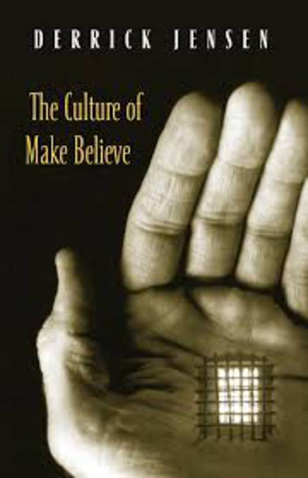

Currently reading:
     <strong>Chaos: Making a New Science by Gleick</strong>, James Gleick
     <strong>THE IMPOSTER’S HANDBOOK</strong>, Rob Conery
     <strong>An introduction to neural networks</strong>, Ben Kröse, Patrick van der Smagt

<!-- ON HOLD -->

    
On hold
 
    
<strong>Artificial Neural Networks</strong>, Robert J. Schalkoff

    
<strong>The Mass Psychology of Fascism</strong>, Wilhelm Reich

    

<!-- THE BIG NINE -->

    
The Big Nine: How the Tech Titans and Their Thinking Machines Could Warp Humanity | Amy Webb

    
    
Finished reading: 28/06/2020

    
Publisher: PublicAffairs

    
<a href="https://www.publicaffairsbooks.com/titles/amy-webb/the-big-nine/9781541773745/">Publisher Site</a>

    <h3>Quotes</h3>
    <blockquote>
        
<em>&quot;What Zero also proved is that algorithms were now capable of learning without guidance from humans, and it was us humans who’d been holding AI systems back.&quot;</em>

    </blockquote>
    <blockquote>
        
<em>&quot;But who, exactly, is the “we” these AI systems are being modeled on? Whose values, ideals, and worldviews are being taught?&quot;</em>

        
<em>&quot;The short answer is not yours—and also not mine. Artificial intelligence has the mind of its tribe, prioritizing its creators’ values, ideals, and worldviews. But it is also starting to develop a mind of its own.&quot;</em>

    </blockquote>
    <blockquote>
        
<em>&quot;AI-powered directional microphones and smart cameras now dot the highways and streets of Shanghai. Drivers who honk excessively are automatically issued a ticket via Tencent’s WeChat, while their names, photographs, and national identity card numbers are displayed on nearby LED billboards.&quot;</em>

    </blockquote>

<!-- Η ΣΕΞΟΥΑΛΙΚΟΤΗΤΑ ΚΑΙ Ο ΘΑΝΑΤΟΣ -->

    
Η ΣΕΞΟΥΑΛΙΚΟΤΗΤΑ ΚΑΙ Ο ΘΑΝΑΤΟΣ | RUFFIE JACQUES

    
    
Finished reading: 30/03/2020

    
Publisher: Εκδόσεις ΡΑΠΠΑ

    
<a href="http://www.biblionet.gr/book/19360/Ruffi%C3%A9,_Jacques/%CE%97_%CF%83%CE%B5%CE%BE%CE%BF%CF%85%CE%B1%CE%BB%CE%B9%CE%BA%CF%8C%CF%84%CE%B7%CF%84%CE%B1_%CE%BA%CE%B1%CE%B9_%CE%BF_%CE%B8%CE%AC%CE%BD%CE%B1%CF%84%CE%BF%CF%82">BiblioNet</a>

    <h3>Quotes</h3>
    <blockquote>
        
<em>&quot;Αντίθετα με ό,τι πιστεύουμε, το φύλο δεν είναι κατ' ανάγκην σταθερό χαρακτηριστικό για ολόκληρη τη ζωή. Σε ορισμένα ζώα παρατηρούμε μια αλλαγή φύλου με την πάροδο του χρόνου. Το φαινόμενο ονομάζεται διαδοχικός ερμαφροδιτισμός.&quot;</em>

    </blockquote>

<!-- Do Androids Dream Of Electric Sheep? -->

    
Do Androids Dream Of Electric Sheep? | Philip K. Dick

    
    
Finished reading: 15/03/2020

    
Publisher: Weidenfeld & Nicolson

    
<a href="https://www.weidenfeldandnicolson.co.uk/titles/philip-k-dick/do-androids-dream-of-electric-sheep/9781780220383/">Publisher's website</a>

    <h3>Quotes</h3>
    <blockquote>
        
<em>&quot;He had wondered as had most people at one time or another precisely why an android bounced helplessly about when confronted by an empathy-measuring test. Empathy, evidently, existed only within the human community, whereas intelligence to some degree could be found throughout every phylum and order including the arachnida. For one thing, the emphatic faculty probably required an unimpaired group instinct; a solitary organism, such as a spider, would have no use for it; in fact it would tend to abort a spider's ability to survive. It would make him conscious of the desire to live on the part of his prey. Hence all predators, even highly developed mammals such as cats, would starve. Empathy, he once had decided, must be limited to herbivores or anyhow omnivores who could depart from a meat diet. Because, ultimately, the emphatic gift blurred the boundaries between hunter and victim, between the successful and the defeated.&quot;</em>

    </blockquote>

<!-- Death at Intervals -->

    
Death at Intervals | José Saramago

    
    
Finished reading: 09/02/2020

    
Publisher: VINTAGE

    
<a href="https://en.wikipedia.org/wiki/Death_with_Interruptions">Wikipedia entry</a>

    <h3>Quotes</h3>
    <blockquote>
        
<em>&quot;Death's perplexity is perfectly understandable. She was placed in this world so long ago that she can no longer remember from whom she received the necessary instructions to carry out the job she was charged with. They placed the regulations in her hands, pointed out the words thou shalt kill as the one guiding light of her future activities and told her, doubtless not noticing the macabre irony, to get on with her life.&quot;</em>

    </blockquote>

<!-- Grokking Algorithms: An illustrated guide for programmers and other curious people -->

    
Grokking Algorithms: An illustrated guide for programmers and other curious people | Aditya Y. Bhargava 

    
    
Finished reading: 14/01/2020

    
Publisher: Manning Publications 

    
<a href="https://www.manning.com/books/grokking-algorithms">Website</a>

    
A Mind For Numbers: How to Excel at Math and Science | Barbara Oakley 

    
    
Finished reading: 20/12/2019

    
Publisher: TarcherPerigee 

    
<a href="https://barbaraoakley.com/books/a-mind-for-numbers/">Author's Website</a>

    
Το Τέλος | Σάμουελ Μπέκετ 

    
    
Finished reading: 11/2019

    
Publisher: Εκδόσεις Αλεξάνδρεια

    
<a href="http://alexandria-publ.gr/shop/to-telos/">Link</a>

    <h3>Quotes</h3>
    <blockquote>
        

             
            <em>&quot;Δεν αισθανόμουν καλά, όμως μου είπαν ότι ήμουν αρκετά καλά. Δεν είπαν βέβαια κατά λέξη ότι δεν επρόκειτο ποτέ να αισθανθώ καλύτερα, το έπιασα όμως το υπονοούμενο.&quot;</em>
        

    </blockquote>

    
Το περίσσιο παιδί | Θανάσης Τριαρίδης 

    
    
Finished reading: 11/2019

    
Publisher: Εκδόσεις Gutenberg

    
<a href="https://www.dardanosnet.gr/book_details.php?id=2582">Link</a>

    
Ο Κομμουνιστής της Μονμάρτης | Michael Kleeberg 

    
    
Finished reading: 08/2019

    
Publisher: Εκδόσεις Άγρα

    
<a href="http://www.biblionet.gr/book/220517/Kleeberg,_Michael/%CE%9F_%CE%BA%CE%BF%CE%BC%CE%BC%CE%BF%CF%85%CE%BD%CE%B9%CF%83%CF%84%CE%AE%CF%82_%CF%84%CE%B7%CF%82_%CE%9C%CE%BF%CE%BD%CE%BC%CE%AC%CF%81%CF%84%CF%81%CE%B7%CF%82">BiblioNet link</a>

    
A View from the Bridge / All My Sons | Arthur Miller 

    
    
Finished reading: 08/2019

    
Publisher: Penguin Classics

    
<a href="https://www.goodreads.com/book/show/437965.A_View_from_the_Bridge_All_My_Sons">GoodReads link</a>

    
The Good Person of Szechwuan | Bertolt Brecht 

    
    
Finished reading: 08/2019

    
Publisher: Methuen Drama

    
<a href="https://en.wikipedia.org/wiki/The_Good_Person_of_Szechwan">Wikipedia link</a>

    <h3>Quotes</h3>
    <blockquote>
        

             
            <em>&quot;<strong>SHEN TEH:</strong> I am not good. I have an admission to make: when Wang asked me if I could shelter you I had hesitations.&quot;</em>
              
            <em>&quot;<strong>THE FIRST GOD:</strong> Hesitations do not count if you overcome them.&quot;</em>
             
        

    </blockquote>
    <blockquote>
        

             
            <em>&quot;<strong>SHEN TEH:</strong> Wait, Illustrious Ones. I am by no means sure that I am good. I should certainly like to be, but how am I to pay the rent? Let me admit: I sell myself in order to live, and even so I cannot manage, for there are so many forced to do this. I would take on anything, but who would not? Of course I should like to obey the commadmentments: to honour my parents and respect the truth. Not to covet my neighbour's house would be a joy to me, and to love, honour and cherish a husband would be very pleasant. Nor do I wish to exploit other men or to rob the defenceless. But how can it be done? Even by breaking one or two of the commadments I can barely manage. &quot;</em>
              
            <em>&quot;<strong>THE FIRST GOD:</strong> All these, Shen Teh, are but the doubts of a good person.&quot;</em>
             
        

    </blockquote>

    
The Gods Will Have Blood | Anatole France 

    
    
Finished reading: 08/2019

    
Publisher: Penguin Classics

    
<a href="https://en.wikipedia.org/wiki/The_Gods_Are_Athirst">Wikipedia link</a>

    <h3>Quotes</h3>
    <blockquote>
        
<em>&quot;Do allow me to give you a word of advice, citizen. If you want to make something of your life, give up your packs of patriotic cards, forget about your revolutionary symbols, your Hercules, your Hydras, your Furies pursuing traitors, your geniuses of Liberty – and paint me some pretty girls. Citizens' enthusiasm for self-reformation diminishes with time; men's love for women never.&quot; p.52</em>

    </blockquote>

    
Η ΑΛΓΟΡΙΘΜΙΚΗ ΤΕΧΝΗ ΤΩΝ ΑΠΟΦΑΣΕΩΝ: Η επιστήμη των υπολογιστών στην καθημερινή ζωή | BRIAN CHRISTIAN & TOM GRIFFITHS

    
    
Finished reading: 08/2019

    
Publisher: ΠΑΝΕΠΙΣΤΗΜΙΑΚΕΣ ΕΚΔΟΣΕΙΣ ΚΡΗΤΗΣ SCI-CLOPEDIA

    
Μετάφραση: Αλέξανδρος Χορταράς

    
<a href="https://www.goodreads.com/book/show/43194493">Goodreads link</a>

    <h3>Quotes</h3>
    <blockquote>
        
<em>&quot;Ένας αλγόριθμος, όμως, είναι απλώς μια ακολουθία βημάτων που χρησιμοποιούνται για την επίλυση ενός προβλήματος, και οι αλγόριθμοι είναι κάτι πολύ ευρύτερο -και πολύ παλαιότερο- από τους υπολογιστές. Πολύ πριν να χρησιμοποιηθούν για πρώτη φορά από τις μηχανές, οι αλγόριθμοι χρησιμοποιούνταν από τους ανθρώπους. / Σελ. xiv&quot;</em>

    </blockquote>
    <blockquote>
        
<em>&quot;Η αρχή του ΕΜΑ (Επί Μακρότερον Αχρησιμοποίητου) μας διδάσκει ότι το επόμενο πράγμα που μπορούμε να περιμένουμε ότι θα χρειαστούμε είναι το τελευταίο πράγμα που χρειαστήκαμε, ενώ εκείνο που θα χρειαστούμε αμέσως μετά είναι πιθανότατα αυτό που χρησιμοποιήσαμε προτελευταίο. Και το τελευταίο πράγμα που μπορούμε να περιμένουμε ότι θα χρειαστούμε είναι αυτό που δεν έχουμε χρειαστεί το μεγαλύτερο χρονικό διάστημα. / Σελ. 96&quot;</em>

    </blockquote>

    
Thinking, Fast and Slow | Daniel Kahneman

    
    
Finished reading: 2019

    
<a href="https://en.wikipedia.org/wiki/Thinking,_Fast_and_Slow">Wikipedia link</a>

    
Sapiens: A Brief History of Humankind | Yuval Noah Harari

    
    
Finished reading: 2019

    
<a href="https://en.wikipedia.org/wiki/Sapiens:_A_Brief_History_of_Humankind">Wikipedia link</a>

<!-- ΒΙΟΣ ΚΑΙ ΠΟΛΙΤΕΙΑ ΤΟΥ ΑΛΕΞΗ ΖΟΡΜΠΑ -->

    
Βίος και Πολιτεία του Αλέξη Ζορμπά | Νίκος Καζαντζάκης

    
Finished reading: 2018

<!-- ΒΑΚΧΑΙ -->

    
Βάκχαι | Ευριπίδης 

    
Finished reading: 2018

    
Publisher: Κάκτος

    
<a href="https://www.kaktos.gr/000136">Publisher's Website</a>

    
Kill All Normies: Online Culture Wars from 4chan and Tumblr to Trump and the Alt-Right | Angela Nagle

    
    
Finished reading: 2018

    
Publisher: Zero Books

    
<a href="https://en.wikipedia.org/wiki/Kill_All_Normies">Wikipedia link</a>

    
Έλεος και Θνητότητα στην Βιέννη | Thomas Pynchon

    
    
Finished reading: 2018

    
Publisher: Κακός Βηξ

    
Original Title: Mercy and Mortality in Vienna

    
<a href="https://www.goodreads.com/book/show/36380925">Goodreads link</a>

    
Οι Διεργασίες της Σκέψης στην Εποχή της Πληροφορίας: Θέματα Γνωστικής Ψυχολογίας και Επικοινωνίας | Ντάβου Μπετίνα

    
Finished reading: 2016

    
ΒιβλίοNet Link

    
The Trouble With Testosterone: And Other Essays On The Biology Of The Human Predicament | Sapolsky, Robert M.

    
Finished reading: 2015

    
<a href="https://www.goodreads.com/book/show/20668.The_Trouble_with_Testosterone_and_Other_Essays_on_the_Biology_of_the_Human_Predicament">goodreads.com link</a>

    
Πριν το Τέλος | Κρίστοφερ Χίτσενς

    
Εκδόσεις Μεταίχμιο

    <h3>Quotes</h3>
    <blockquote>
        
<em>&quot;Γεναίος; Χα! Κράτα τον χαρακτηρισμό για καμιά μάχη από την οποία δεν μπορείς να το σκάσεις.&quot;</em>

    </blockquote>

    
The Culture of Fear: Why Americans Are Afraid of the Wrong Things | Barry Glassner

    
Basic Books

    
<a href="https://en.wikipedia.org/wiki/Culture_of_fear">Wikipedia link</a>

    <h3>Quotes</h3>
    <blockquote>
        
<em>&quot;Disproportionate coverage in the news media plainly has effects on readers and viewers. When Esther Madriz, a professor at Hunter College, interviewed women in New York City about their fears of crime they frequently responded with the phrase "I saw it in the news." The interviewees identified the news media as both the source of their fears and the reason they believed those fears were valid. Asked in a national poll why they believe the country has a serious crime problem, 76 percent of people cited stories they had seen in the media. Only 22 percent cited personal experience.&quot;</em>

    </blockquote>
    <blockquote>
        
<em>&quot;Television news programs survive on scares. On local newscasts, where producers live by the dictum "if it bleeds, it leads," drug, crime, and disaster stories make up most of the news portion of the broadcasts. Evening newscasts on the major networks are somewhat less bloody, but between 1990 and 1998, when the nation's murder rate declined by 20 percent, the number of murder stories on network newscasts increased 600 percent (not counting stories about O.J. Simpson).&quot;</em>

    </blockquote>

    
Toxic Sludge Is Good for You: Lies, Damn Lies and the Public Relations Industry | John Stauber, Sheldon Rampton

    
Finished reading: ...

    
<a href="https://www.goodreads.com/book/show/659246.Toxic_Sludge_Is_Good_for_You">goodreads.com link</a>

    <h3>Quotes</h3>
    <blockquote>
        
<em>&quot;The best PR is never noticed&quot;</em>

    </blockquote>
    <blockquote>
        
<em>&quot;On the surface it seemed like an ordinary publicity stunt for 'female emancipation'. [...] A contingent of New York debutantes marched down Fifth Avenue in the 1929 Easter Parade, each openly lighting and smoking cigarettes. It was the first time in the memory of most Americans that any woman who wasn't a prostitute had been seen smoking in public. It was dubbed the &quot;torches of liberty contingent&quot; by Edward Bernays, its brilliant behind-the-scenes organizer. [...] later admitted that he had been paid a tidy sum to orchestrate the march by George Washington Hill, president of the American Tobacco Company. [...] it had achieved its goal of breaking the taboo against female smoking.&quot;</em>

    </blockquote>

    
Ο Αλγόριθμος της Μελαγχολίας | Κάρλο Φραμπέτι

    
Finished reading: ...

    
Publisher: Opera

    
<a href="https://www.operabooks.gr/book_details/82/4/1/">Publisher's Website Link</a>

    <h3>Quotes</h3>
    <blockquote>
        
<em>&quot;Ποιά είναι η καλύτερη ερώτηση που μπορεί να τεθεί, και ποιά είναι η καλύτερη απάντηση που μπορεί να δοθεί;" ρώτησε ο Επιμενίδης. Και ο Βούδας αποκρίθηκε: "Η καλύτερη ερώτηση που μπορεί να τεθεί, είναι αυτή που μόλις μου έθεσες, και η καλύτερη απάντηση που μπορεί να δοθεί, είναι αυτή που σου δίνω τώρα.&quot;</em>

    </blockquote>

    
Το Βιβλίο Κόλαση | Κάρλο Φραμπέτι

    
Finished reading: ...

    
Publisher: Opera

    
<a href="https://www.operabooks.gr/book_details/94/0/">Publisher's Website Link</a>

    <h3>Quotes</h3>
    <blockquote>
        
<em>&quot;"Κατ' αρχάς ελάχιστοι είναι αυτοί που μπορούν να κάνουν πραγματικά χωρίς θρησκευτικούς μύθους" απάντησε ο βιβλιοθηκάριος. "Οι περισσότεροι απ' αυτούς που πιστευουν ότι μπορούν να κάνουν χωρίς τη θρησκεία, γατζώνονται σε μια σειρά υποκατάστατων μύθων (ψευδο-επιστημονικών, πατριωτικών, εσωτερικιστικών), οι οποίοι ναι με δεν εξορκίζουν το φόβο του θανάτου αλλά τουλάχιστον απαλύνουν τον φόβο της ζωής. Δεύτερον, ο ίδιος ο θάνατος είναι ένα φαινόμενο μοναδικό, οριστικό, που όλοι σχεδόν το βλέπετε σαν κάτι θολό και μακρινό, κάτι που, όπως και ο Ήλιος δεν μπορείς να το δεις καταπρόσωπο. Δεν υπάρχει εμπειρία θανάτου, μας θυμίζει ο Επίκουρος: όταν είσαι εσύ, δεν είναι ο θάνατος. Όταν είναι ο θάνατος δεν είσαι εσύ πια.* Αντίθετα, η μοναξιά είναι μια εμπειρία συχνή (για να μη πω συνεχής) και άμεση, πολύ δύσκολο να την καταπραύνεις κατά τρόπο στοιχειωδώς ικανοποιητικό στο σκληρό σας κόσμο. Η ανάγκη να παραμυθιαστείτε σε ό,τι αφορά στη μοναξιά, είναι πολύ πιο άμεση και επιτακτική από την ανάγκη να παραμυθιαστείτε σε ό,τι αφορά στο θάνατο. Γι΄αυτό και ο έρωτας είναι ο βασικός, ο θεμελιώδης μύθος σας."&quot;</em>

        
<em>&quot;"Αυτός είναι ο δεύτερος κύκλος, ο κύκλος των λάγνων" ανήγγειλε επίσημα ο δαίμονας. "Εδώ θα συναντήσεις όλα σχεδόν τα βιβλία αγάπης..." "Γιατί σχεδόν όλα;" "Γιατί σχεδόν όλα δίνουν αξία, αν δεν την εξυμνούν απροκάλυπτα, στην κτηνώδη συνήθεια να καταβροχθίζουμε τους άλλους." "Μα η λαγνεία..." "Η αγάπη είναι λαγνεία" με διέκοψε ο βιβλιοθηκάριος. "Η λαγνεία είναι η υπέρμετρη όρεξη για σαρκικές απολαύσεις, και τι πιο υπέρμετρη όρεξη απ΄την επιθυμία ν΄αποκτήσεις ένα κομμάτι κρέας μόνο για σένα και για όλη σου τη ζωή, να καταπιείς ζωντανό κάποιο άλλο πρόσωπο;"&quot;</em>

    </blockquote>

    
Απολογία ενός Ανθέλληνα | Νίκος Δήμου

    
Finished reading: ...

    
Publisher: Opera

    
<a href="http://www.ndimou.gr/el/keimena/anthologia/dokimia/apologia/">Link from Author's site</a>

    <h3>Quotes</h3>
    <blockquote>
        
<em>&quot;Στις σχέσεις λαών (και ανθρώπων) το απόλυτο είναι τερατώδες. Οδηγεί σε θηριωδίες και καταστροφές. Πρέπει να καταπολεμηθεί κάθε τι το απόλυτο, κάθε άποψη που γεννάει φανατισμό και αποκλεισμό του άλλου. Ο συμβιβασμός δεν είναι ταπείνωση – είναι η ουσία της ανθρωπιάς, το παιδί του διαλόγου, η σοφία της δημοκρατίας.&quot;</em>

    </blockquote>

    
Δίψα για Έρωτα | Γιούκιο Μισίμα

    
Finished reading: ...

    
Publisher: Εκδόσεις Καστανιώτη

    
<a href="https://www.kastaniotis.com/book/978-960-03-6147-6">Link from Publisher's site</a>

    
The Culture of Make Believe | Derrick Jensen

    
    
Finished reading: ...

    
<a href="https://en.wikipedia.org/wiki/The_Culture_of_Make_Believe">Wikipedia link</a>

    <h3>Quotes</h3>
    <blockquote>
        
<em>&quot;When discussing hate groups, why do we so often constrict our vision to include only the most absurd, the most grotesque, the most individual or small-scale of crimes? Why not go after larger targets? What about hatred or exploitation that is systematic, that is codified, that hides behind the screen of law, religion, philosophy, science?&quot;</em>

    </blockquote>

    
Πορνογραφία και Αισχρότητα | D.H. Lawrence

    
Finished reading: ...

    
Publisher: ΡΟΕΣ | microMEGA

    
<a href="http://www.biblionet.gr/book/4137/Lawrence,_David_Herbert,_1885-1930/%CE%A0%CE%BF%CF%81%CE%BD%CE%BF%CE%B3%CF%81%CE%B1%CF%86%CE%AF%CE%B1_%CE%BA%CE%B1%CE%B9_%CE%B1%CE%B9%CF%83%CF%87%CF%81%CF%8C%CF%84%CE%B7%CF%84%CE%B1">link</a>

    <h3>Quotes</h3>
    <blockquote>
        
<em>&quot;…ποτέ η όρεξη για πορνογραφία δεν ήταν δυνατότερη από όσο σήμερα. Αποτελεί σημάδι της αρρωστημένης κατάστασης της πολιτείας / κοινωνίας. Αλλά ο τρόπος για να γιατρευτεί η αρρώστια είναι να μιλάμε ανοιχτά για το σεξ και το σεξουαλικό ερέθισμα. [...] Μόνο μια φυσική, φρέσκια ειλικρίνεια σχετικά με το σεξ θα ωφελούσε, τώρα που έχουμε κατακλυστεί από την κρυφή ή μισόκρυφή πορνογραφία. Και ίσως οι παραμυθάδες της Αναγέννησης, ο Βοκκάκιος, ο Λάσκα και οι υπόλοιποι να είναι το καλύτερο αντίδοτο που μπορούμε να βρούμε τώρα, ακριβώς όπως το περισσότερο μπλάστρωμα με πουριτανισμό είναι η πιο επιζήμια θεραπεία που μπορούμε να ακολουθήσουμε.&quot;</em>

    </blockquote>
    <blockquote>
        
<em>&quot;Διότι κάθε άνθρωπος έχει μέσα του και τον όχλο και το άτομο, σε διαφορετικές αναλογίες. Μερικοί έχουν σχεδόν αποκλειστικά τον όχλο μέσα τους, είναι ανίκανοι για ευφάνταστες ατομικές αντιδράσεις. […] Η αντίδραση του καθενός σε μια λέξη μπορεί να είναι αντίδραση είτε του όχλου, είτε ατομική. Εναπόκειται στον άνθρωπο να αναρωτηθεί: Είναι η αντίδρασή μου ατομική, ή απλώς αντιδρώ με την ιδιότητα του όχλου;&quot;</em>

    </blockquote>

    
Οι Έχοντες και οι μη Κατέχοντες | Noam Chomsky

    

    
Finished reading: ...

    
Publisher: Εκδόσεις Καστανιώτη

    
<a href="https://eds.b.ebscohost.com/eds/detail/detail?vid=1&sid=71ca933c-a38d-48aa-ae47-f922b5ee967e%40pdc-v-sessmgr04&bdata=Jmxhbmc9ZWwmc2l0ZT1lZHMtbGl2ZQ%3d%3d#AN=nlg.152936&db=cat05962a">National Library of Greece link</a>

    
<a href="https://en.wikipedia.org/wiki/Class_Warfare">Wikipedia Link (Original)</a>

    <h3>Quotes</h3>
    <blockquote>
        
<em>&quot;Τα στοιχεία του ΟΗΕ αποκαλύπτουν ότι προκειμένου να διασφαλιστεί η εκπαίδευση, η υγειονομική περίθαλψη, η επάρκεια τροφής και ασφαλείς εγκαταστάσεις ύδρευσης και αποχέτευσης για πάνω από δυο δισεκατομμύρια ανθρώπους (εκ των οποίων το ένα δισεκατομμύριο διαθέτει εισόδημα μικρότερο από ένα δολάριο την ημέρα) που στερούνται αυτά τα στοιχειώδη αγαθά θα απαιτούνταν μόλις το 4% (ναι, το τέσσερα τοις εκατό) της περιουσίας των 225 πλέον πλουσίων κατοίκων του πλανήτη μας.&quot;</em>

    </blockquote>
    <blockquote>
        
<em>&quot;Έχει ενδιαφέρον ότι, στη σημερινή πολιτική σκηνή, χρησιμοποιείται σε πολύ μεγάλο βαθμό η παθητική φωνή. Για παράδειγμα, στο New Yorker δημοσιεύτηκε στις 16 Οκτωβρίου ένα άρθρο για την ανισότητα των εισοδημάτων, στο οποίο χρησιμοποιείται συνέχεια η παθητική φωνή. Η ανισότητα είναι κάτι που υφίσταται. Δεν υπάρχει ποιητικό αίτιο, δεν υπάρχει κάποιος υπεύθυνος. Η ενεργητική φωνή δεν χρησιμοποιείται. Οι άνθρωποι γίνονται φτωχότεροι. Δεν τους κάνει κάποιος φτωχότερους. Απλά, είναι κάτι που συμβαίνει.&quot;</em>

    </blockquote>

    
Beyond Beef: The Rise and Fall of the Cattle Culture | Jeremy Rifkin

    

    
Finished reading: ...

    
Publisher: Plume

    
<a href="https://www.goodreads.com/book/show/122381.Beyond_Beef">Goodreads.com Link</a>

    <h3>Quotes</h3>
    <blockquote>
        
<em>&quot;There are currently 1.28 billion cattle populating the earth[1]. They graze on nearly 24 percent of the landmass of the planet and consume enough grain to feed hundreds of millions of people. Their combined weight exceeds that of the human population on earth.&quot;</em>

    </blockquote>
    <blockquote>
        
<em>&quot;Cattle raising is a primary factor in the destruction of the world's remaining tropical rain forests. Millions of acres of ancient forests in Central and South America are being felled and cleared to make room for pastureland to graze cattle. Cattle herding is responsible for much of the spreading desertification in the sub-Sahara of Africa and the western rangeland of the United States and Australia.&quot;</em>

    </blockquote>
    <blockquote>
        
<em>&quot;In developing nations, millions of peasants are being forced off their ancestral lands to make room for the conversion of farmland from subsistence food grain production to commercial feed grain production. While millions of human beings go hungry for lack of adequate grain, millions more in the industrial world die from diseases caused by an excess of grain-fed animal flesh, and especially beef, in their diets. Americans, Europeans, and increasingly the Japanese are gorging on grain-fed beef and dying from the "diseases of affluence" - heart attacks, strokes and cancer.&quot;</em>

    </blockquote>
    <blockquote>
        
<em>&quot;The book concludes with a plea to humanity to move beyond the beef culture in the twenty-first century. Dismantling the global cattle complex and significantly reducing the consumption of beef is an essential task of the coming decades if we are to have any hope of restoring our planet to health and feeding a growing human population.&quot;</em>

    </blockquote>

    
ΛΑΚΑΝ | Slavoj Zizek

    
    

    
Publisher: ΕΚΔΟΣΕΙΣ ΠΑΤΑΚΗ

    
<a href="http://www.biblionet.gr/book/140277/%C5%BDi%C5%BEek,_Slavoj/%CE%9B%CE%B1%CE%BA%CE%AC%CE%BD">BiblioNet Link</a>

    <h3>Quotes</h3>
    <blockquote>
        
<em>&quot;Το φροϋδικό ασυνείδητο προκάλεσε τέτοιο σκάνδαλο όχι εξαιτίας του ισχυρισμού ότι ο ορθολογικός εαυτός υπόκειται στο πολύ ευρύτερο φάσμα των ανορθολογικών τυφλών ενστίκτων, αλλά επειδή κατέδειξε τον τρόπο με τον οποίο το ασυνείδητο υπακούει σε μια δική του γραμματική και λογική: το ασυνείδητο σκέπτεται και ομιλεί. (σ.12)&quot;</em>

    </blockquote>

    
Η ΚΑΡΔΙΑ ΤΟΥ ΣΚΟΤΟΥΣ | CONRAD JOSEPH

     
    
    
Finished reading: ?

    
Publisher: ΠΑΤΑΚΗΣ

    
<a href="http://www.biblionet.gr/book/2574/Conrad,_Joseph,_1857-1924/%CE%97_%CE%BA%CE%B1%CF%81%CE%B4%CE%B9%CE%AC_%CF%84%CE%BF%CF%85_%CF%83%CE%BA%CF%8C%CF%84%CE%BF%CF%85%CF%82">BiblioNet</a>

    
Περί Τυφλότητας | Ζοζέ Σαραμάγκου

     
    
    
Finished reading: 200x

    
Publisher: ΕΚΔΟΣΕΙΣ ΚΑΣΤΑΝΙΩΤΗ

    
<a href="http://www.biblionet.gr/book/134736/Saramago,_Jos%C3%A9,_1922-2010/%CE%A0%CE%B5%CF%81%CE%AF_%CF%84%CF%85%CF%86%CE%BB%CF%8C%CF%84%CE%B7%CF%84%CE%BF%CF%82">BiblioNet</a>

    
Τα Μαύρα Φεγγάρια του Έρωτα | Πασκάλ Μπρυκνέρ

    

    
Finished reading: ...

    
Publisher: ΑΣΤΑΡΤΗ

    
<a href="http://www.biblionet.gr/book/9588/Bruckner,_Pascal,_1948-/%CE%A4%CE%B1_%CE%BC%CE%B1%CF%8D%CF%81%CE%B1_%CF%86%CE%B5%CE%B3%CE%B3%CE%AC%CF%81%CE%B9%CE%B1_%CF%84%CE%BF%CF%85_%CE%AD%CF%81%CF%89%CF%84%CE%B1">BiblioNet Link</a>

    <h3>Quotes</h3>
    <blockquote>
        
<em>&quot;Συνήθως, συνδέομαι με πλάσματα που δε μ΄ έχουν ανάγκη και που ξαφνικά βρίσκονται δεμένα με τα πιο δυνατά δεσμά. Έιμαι έτοιμος να δώσω τα πάντα σ΄ αυτόν που δε ζητάει τίποτα, μα δεν παραχωρώ το παραμικρό σ΄αυτόν που περιμένει τα πάντα. Ερωτεύτηκα τη Ρεβέκα γιατί είχε δεχτεί το δεσμό μας σαν μια παραπάνω ευτυχία σε μια ήρεμη ύπαρξη, κι όχι σαν μια σανίδα σωτηρίας σε μια απελπισμένη μοναξιά.&quot;</em>

    </blockquote>
    <blockquote>
        
<em>&quot;Ο έρωτας φυσικά είναι δυο μοναξιές που ζευγαρώνουν για να φτιάξουν μια παρεξήγηση. Υπάρχει όμως πιο γοητευτική παρεξήγηση; Και η πραγματική σοφία δεν είναι άραγε η ικανότητα να ερωτεύεται κανείς ξανά και ξανά;&quot;</em>

    </blockquote>

    
A Short History of Progress | Ronald Wright

    

    
Finished reading: ...

    
Publisher: Canongate Books

    
<a href="https://en.wikipedia.org/wiki/A_Short_History_of_Progress">Wikipedia Link</a>

    <h3>Quotes</h3>
    <blockquote>
        
<em>&quot;I came up with the term 'Progress Trap' to define human behaviors that, sort of, seem to be good things. Seem to provide benefits in the sort term but ultimately lead to disaster because they are unsustainable.&quot;</em>

    </blockquote>
     
    <blockquote>
        
<em>&quot;Our physical bodies and our physical brains, as far as we can tell, have changed very little in the past 50.000. We've only been living in civilization for the last 5.000 years at the most, which is less than 0.2% of our evolutionary history. So the other 99.8% we were hunters and gatherers and that is the kind of way of life, that made us. We are essentially the same people as those Stone Age hunters. [...] So, we are running 21st century software or knowledge on hardware that hasn't been upgraded for 50.000 years. And this lies at the core of many of our problems.&quot;</em>

    </blockquote>
     
    <blockquote>
        
<em>&quot;All of this is because our human nature is back in the hunting gathering era of the old Stone Age, whereas our knowledge and our technology, in other words our ability to do both good and harm to ourselves and to the world in general, has grown out of all proportion.&quot;</em>

    </blockquote>

    
Η Απάτη της Στατιστικής | Darrel Huff

    
    
Finished reading: ...

    
Publisher: Εκδόσεις Οξύ

    
<a href="http://www.biblionet.gr/book/27443/Huff,_Darrel/%CE%97_%CE%B1%CF%80%CE%AC%CF%84%CE%B7_%CF%84%CE%B7%CF%82_%CF%83%CF%84%CE%B1%CF%84%CE%B9%CF%83%CF%84%CE%B9%CE%BA%CE%AE%CF%82">BiblioNet link</a>

    
Original Title:<strong>How to Lie with Statistics</strong>

    
Test Card F: Television, Mythinformation and Social Control

    
    
Finished reading: ...

    
Publisher: AKPress

    
<a href="https://www.akpress.org/testcardf.html">link</a>

    <h3>Quotes</h3>
    <blockquote>
        
<em>&quot;The image operates upon us in a manner which conceals its ideological function because it appears to record rather than to transform. Its power lies in its visual character as an actual trace of reality, the evidence of our own eyes - 'this really happened, see for yourself'&quot;</em>

    </blockquote>
     
    <blockquote>
        
<em>&quot;Information is disseminated in such quantity and at such speed that confirmation becomes impossible.&quot;</em>

    </blockquote>
     
    <blockquote>
        
<em>&quot;Often when open propaganda is conveyed we are on our guard, but we tend to be less so when we believe we are simply receiving 'information'.&quot;</em>

    </blockquote>
     

    
Τα Πάθη του Νεαρού Βέρθερου | GOETHE

    
    

    
Publisher: ΕΚΔΟΣΕΙΣ ΑΓΡΑ

    
<a href="http://www.biblionet.gr/book/21513/Goethe,_Johann_Wolfgang_von,_1749-1832/%CE%A4%CE%B1_%CF%80%CE%AC%CE%B8%CE%B7_%CF%84%CE%BF%CF%85_%CE%BD%CE%B5%CE%B1%CF%81%CE%BF%CF%8D_%CE%92%CE%AD%CF%81%CE%B8%CE%B5%CF%81%CE%BF%CF%85">BiblioNet link</a>

    <h3>Quotes</h3>
    <blockquote>
        
<em>&quot;3 Σεπτεμβρίου Μερικές φορές δεν μπορώ να συλλάβω πως μπορεί, πως έχει το δικαίωμα να την αγαπάει ένας άλλος, τη στιγμή που εγώ την αγαπώ τόσο μοναχικά, τόσο βαθιά και με τέτοια πληρότητα και δεν γνωρίζω ούτε ξέρω ούτε έχω τίποτε άλλο έγω απ' αυτήν.&quot;</em>

    </blockquote>

    
ΣΗΜΕΙΩΣΕΙΣ ΓΙΑ ΤΟ ΤΡΕΜΑΜΕΝΟ ΣΩΜΑ - ΚΕΙΜΕΝΑ ΠΟΛΙΤΙΚΗΣ ΑΝΑΓΚΗΣ | ΤΡΙΑΡΙΔΗΣ ΘΑΝΑΣΗΣ

    
    

    
Publisher: ΤΥΠΩΘΗΤΩ / ΔΑΡΔΑΝΟΣ

    
<a href="http://www.triaridis.gr/soma/">Online Version</a>

    
Trust Us, We're Experts: How Industry Manipulates Science and Gambles With Your Future | Sheldon Rampton & John Stauber

    
    
Finished reading: 200?

    
Publisher: 

    
<a href="https://en.wikipedia.org/wiki/Trust_Us,_We%27re_Experts">Wikipedia link</a>

    
Endgame Volume I & II | Derrick Jensen

    
    
Finished reading: 200?

    
Publisher: Seven Stories Press

    
<a href="https://en.wikipedia.org/wiki/Endgame_(Derrick_Jensen_books)">Wikipedia link</a>

    
ΤΟ ΚΟΙΝΟ ΚΑΛΟ - ΣΥΝΕΝΤΕΥΞΕΙΣ ΜΕ ΤΟΝ DAVID BARSAMIAN | Noam Chomsky

    
    
Finished reading: 200?

    
Publisher: Scripta

    
<a href="https://www.politeianet.gr/books/9789607909206-chomsky-noam-scripta-to-koino-kalo-152067">link</a>

    
Ο Αναρχικός Τραπεζίτης | Φερνάντο Πεσσόα

     
    
    
Finished reading: 200x

    
Publisher: Gutenberg

    
<a href="https://www.politeianet.gr/books/9789600117981-pessoa-fernando-gutenberg-o-anarchikos-trapezitis-259631?gclid=EAIaIQobChMI-JPXjqux5wIVRIuyCh3bTg1JEAAYASAAEgKtVfD_BwE">link</a>

<!-- Η ΧΕΙΡΑΓΩΓΗΣΗ ΤΩΝ ΜΑΖΩΝ -->

    
Η ΧΕΙΡΑΓΩΓΗΣΗ ΤΩΝ ΜΑΖΩΝ - ΣΥΝΕΝΤΕΥΞΕΙΣ ΜΕ ΤΟΝ DAVID BARSAMIAN | Noam Chomsky

    
    
Finished reading: 200?

    
Publisher: Scripta

    
<a href="https://www.politeianet.gr/books/9789607909039-chomsky-noam-scripta-i-cheiragogisi-ton-mazon-204673">link</a>

<!-- ΤΟ ΔΙΚΑΙΩΜΑ ΣΤΗΝ ΑΠΛΗΣΤΙΑ -->

    
Το Δικαίωμα στην Απληστία | For Ourselves

    
    
Finished reading: 199*

    
Publisher: Εκδόσεις Ερατώ

    
<a href="https://www.goodreads.com/book/show/23212157">Good Reads</a>

    
Νεκρή Ζώνη | Στήβεν Κινγκ

    
Η Αυτοβιογραφία Ενός Ανήλικου Ληστή | Έντουαρντ Λιμόνοφ

    
    
Finished reading: 199*

    
Publisher: Aquarius

    
<a href="https://en.wikipedia.org/wiki/Eduard_Limonov#Books">Wikipedia</a>

